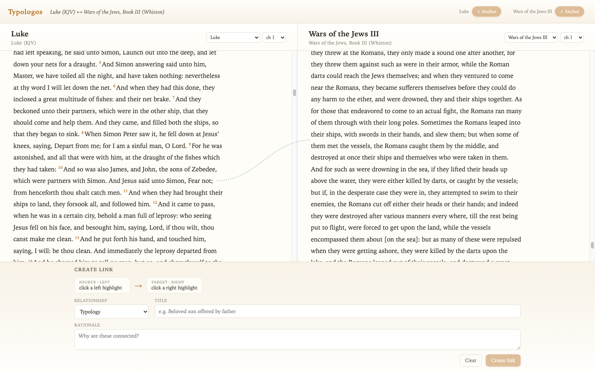
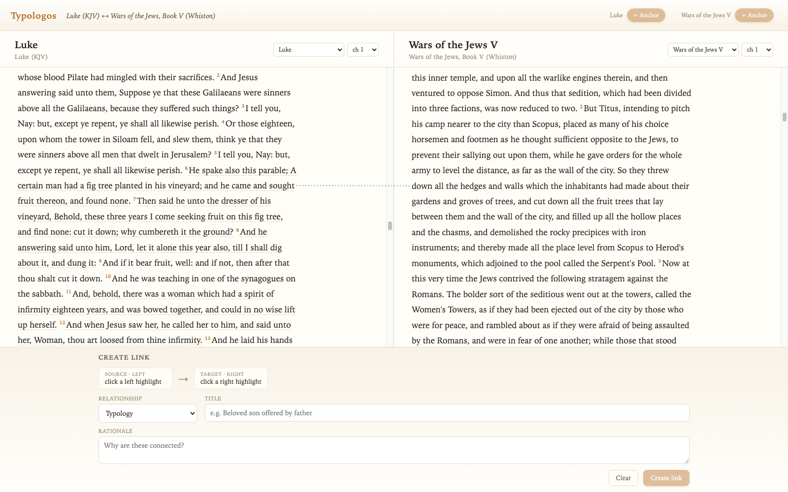
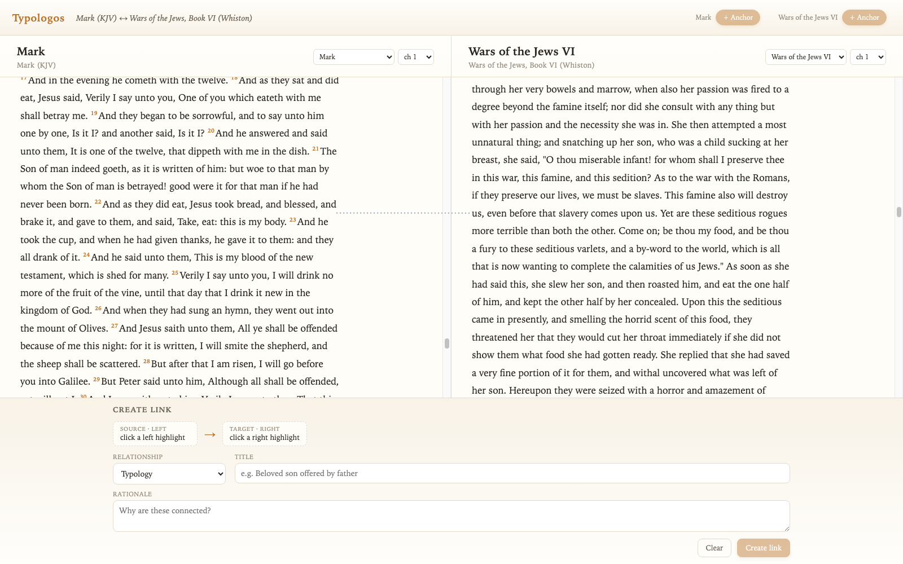
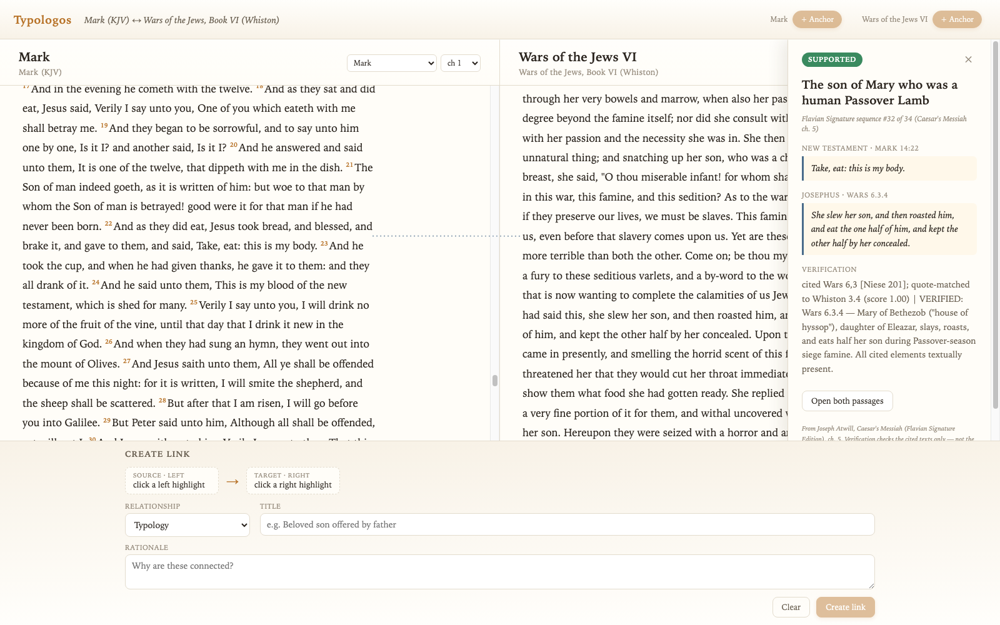

# Night log — 2026-07-10

Overnight autonomous session. Each section notes the git checkpoint so you can
`git checkout <hash>` to see that state. Screenshots in this folder were
captured headlessly via the new deep-link URLs.

## Where things stood at bedtime

Checkpoint `fe5518b` — Wilson's *Dictionary of Bible Types* imported (1,109
motifs / 4,077 verse-anchored instances with his a/b/c grades), dashed
underlines + hover tooltip + Types & Figures drawer, chapter-window panes.

## 1. Continuous book scrolling — `31947bb`

- A pane now holds a **whole book** (one fetch; Exodus ≈ 78,000px of scroll).
  Chapter headings break the verse flow; the navigator's chapter picker
  *scrolls* instead of reloading.
- Short hops scroll smoothly; jumps beyond ~2,500px are instant — Chrome
  paints blank frames if you smooth-scroll 35,000px.
- **Deep links**: `?left=kjv-Gen:3:7&right=kjv-Rev:22:2` restores an exact
  juxtaposition (book:chapter:verse; verse centers on load). This is also how
  these screenshots were reproduced headlessly.
- Old saved views migrate automatically; drawer cross-navigation now scrolls
  in place when the target book is already open.

## 2. Wilson typology arcs — `1ed0c0d`

The reference layer finally has strings. When a verse visible in the left pane
and a verse visible in the right pane share a Wilson motif, a **quiet dashed
arc** connects them (distinct from your solid hand-authored links). Hover
lists the shared motifs; click opens the drawer. Pairs are deduped per verse
pair and the stroke thickens slightly with more shared motifs.

Favorite discovery of the night: **Genesis 3:7 ↔ Revelation 22:2 via "Leaf"**
— fig leaves sewn to cover shame ↔ leaves of the tree of life healing the
nations. The system surfaced that on its own.

### Findings on comprehensibility

- Wilson pairs are **naturally sparse at reading zoom**: the densest
  chapter-vs-chapter pairing in the whole KJV is 2–3 arcs. No spaghetti at
  text scale — the 80-arc cap I built basically never triggers. The "see the
  structure" moment at scale will need the minimap/overview layer.
- Wilson connects verses through **shared symbols** (both verses instantiate
  "Lamb"), not curated type→antitype pairs. So arcs read as "same figure
  appears here and there" — genuinely useful, but a hand-authored link layer
  (or Atwill-style claimed parallels) carries more intent.

### Debugging war story (affects you!)

Arcs computed to zero for a solid hour because **Chrome starves
`requestAnimationFrame` and rendering in occluded windows** — your Chrome was
presumably behind another window while you slept. Position measurement never
ran; even programmatic scrolls don't emit scroll events without rendering
frames. Fix: measurement falls back to a timeout and a slow 800ms poll with a
change-fingerprint (no idle re-renders). The connector overlay was silently
subject to the same bug since day one.

## 3. Caesar's Messiah layer — `0de35c7` + verification commit

The third layer is in, fully separate provenance (`atwill-cm`):

- **Extraction.** Chapter 5 of the Flavian Signature edition parses cleanly
  into the full **34-step sequence** — each step with its NT citation (Luke,
  mostly), its Josephus citation, and both quoted excerpts
  (`apps/server/src/corpus/atwill-parallels.json`). Two steps that Atwill
  cross-references to other chapters (#32 cannibal Mary → ch. 3, #33 three
  crucified → ch. 7) were patched in by hand from those chapters.
- **Josephus corpus.** Whiston's *Wars of the Jews* (7 books, 687 sections)
  and *Life* (76 sections) imported from Project Gutenberg as first-class
  corpus documents — they appear in the pane navigator like any Bible book.
  The Gutenberg text needed defect recovery (a missing CHAPTER heading in
  Book IV, malformed section numbers, endnote blocks masquerading as
  sections).
- **Citation resolution.** Atwill cites (book, chapter, Niese ¶), but his
  chapter numbers follow a different edition's chaptering than Whiston's.
  Resolution matches his quoted excerpt against the actual section texts —
  cited chapter first, whole book as fallback. **All 34 resolved, 0
  low-confidence.**
- **UI.** Parallel arcs render slate-blue dotted (vs. Wilson's amber dashes),
  in either pane orientation; tooltips carry the step title and verdict.

### Checking Atwill against Josephus (the part you asked for)

I pulled the actual Whiston text for **all 34 claims** and compared. Scope of
the check: does the cited passage exist, does it say what Atwill quotes, and
do the two texts actually contain the claimed corresponding elements. I did
**not** adjudicate his authorship thesis — only the textual claims. Verdicts
live in the DB (`parallels.verdict` / `verification`) and surface in the arc
tooltips.

**Final tally: 17 supported · 17 partial · 0 unsupported.** Not one cited
passage was missing or misquoted — Atwill's citations are faithful. The
supported/partial split is entirely about how much of the correspondence
lives in the texts versus in his satiric reading.

**Supported highlights** — the cited texts really contain the claimed elements:
- **#1 Fishing for men**: Wars 3.10.9 *is* a slaughter on the Sea of Galilee
  with men "caught by the vessels." Quote verbatim.
- **#7–9 Gadara herd**: fugitives from **Gadara** driven violently by
  Placidus's cavalry and drowned — "Jordan could not be passed over by
  reason of the dead bodies" (Wars 4.7.4–6). Luke 8:33's herd runs violently
  into the water and drowns, at Gadara.
- **#10 Son of the living god**: Wars 4.10.7, Vespasian concludes Divine
  Providence gave him the empire (verbatim), echoing Peter's confession
  position in the sequence.
- **#24 Fruit tree**: verbatim lexical overlap — Luke "cut it down" / Titus
  "cut down all the fruit trees" before Jerusalem (Wars 5.3.2).
- **#28 Stones**: the "THE SON COMETH" watchmen cry as the white siege stone
  flies (Wars 5.6.3) is genuinely in Josephus.
- **#29 Encircled**: Titus's circumvallation wall (Wars 5.12) vs Luke 19:43 —
  also acknowledged by mainstream scholarship (usually as evidence Luke
  post-dates the siege, not of Flavian authorship).
- **#32 Cannibal Mary**: Wars 6.3.4 — a Mary, daughter of Eleazar, from the
  "house of Hyssop," eats her roasted son during the siege famine. All
  elements textually present.
- **#33 Three crucified**: Life 75 [420-421] — Josephus (bar Matthias) has
  three crucified acquaintances taken down; two die, one survives.

Later finds in the same class: **#13** (messengers sent ahead to Jerusalem),
**#17** (house divided → desolation), **#18** (armed men overcome by a
stronger), **#21** (**Jesus ben Ananias**, the woe-crying Jesus killed by a
siege stone — also a mainstream passion-narrative comparandum), **#23**
(three factions "reduced to two" vs Luke's "three against two" — the numbers
are in both texts), **#27** (emissary sent for terms of peace), **#31**
(cessation of the Daily Sacrifice = Daniel's abomination motif).

**Partial (17)** — quotes faithful, but the correspondence leans on Atwill's
satiric reading rather than shared text (e.g. #2 tribunal/forgiveness, #5
John's wickedness-as-"demon", #15 Titus through Samaria as the Samaritan,
#16 the legion arriving at night as the midnight knock). #34's endpoints
need refining (row currently points at the Nazareth-brow decode; the
Simon/John core is Wars 7.5.6).

### My read after a night with the data

The *textual* phenomena Atwill points at are mostly real — same place names,
same sequence spine (Galilee → road → outside walls → inside city), several
verbatim images. What the tool now makes visible is exactly the thing worth
studying: you can put Luke 13 next to Wars 5.3 and *see* the fruit tree cut
down outside Jerusalem in both. Whether that's Flavian signature, Luke using
Josephus as a source (the mainstream "Luke knew Josephus" hypothesis), or
shared apocalyptic stock imagery — the side-by-side reading is now one click.

## 4. Parallel claim inspector

Clicking a slate-blue arc now opens a claim inspector in the right rail:
verdict chip (green supported / amber partial), Atwill's quoted excerpts for
both sides, the full verification note, and an **Open both passages** button
that sets up the exact side-by-side juxtaposition. Deep-linkable:
`?parallel=par-atwill-32`.

## Morning menu

- **Antiquities + the "Luke used Josephus" layer** (task #7): import
  Whiston's *Antiquities* via the existing pipeline and load the Mason/Pervo
  dependence touchpoints (Theudas/Judas order artifact in Acts 5:36–37 ↔
  Ant. 20.97–102, the Egyptian & sicarii, the census, Lysanias, the Claudius
  famine, Agrippa's death) as `source = 'mason-dependence'` — so all three
  explanations of the shared material (coincidence, dependence, Flavian
  authorship) sit side by side as distinguishable arc layers.
- Refine #34's endpoints (Simon/John core is Wars 7.5.6) and consider adding
  Atwill's foundational parallels from chapters 2–4, 6–7 (Gadara demons in
  depth, Eleazar/Lazarus, Decius Mundus) beyond the ch. 5 sequence.
- The minimap (density strip per pane; the arcs want an overview scale).
- Multi-verse ranges (Atwill's NT citations are ranges; arcs currently anchor
  the first verse).
- `npm run josephus:import && npm run atwill:import` are idempotent and in
  the README.
