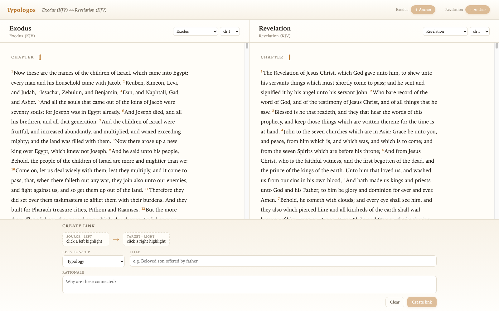
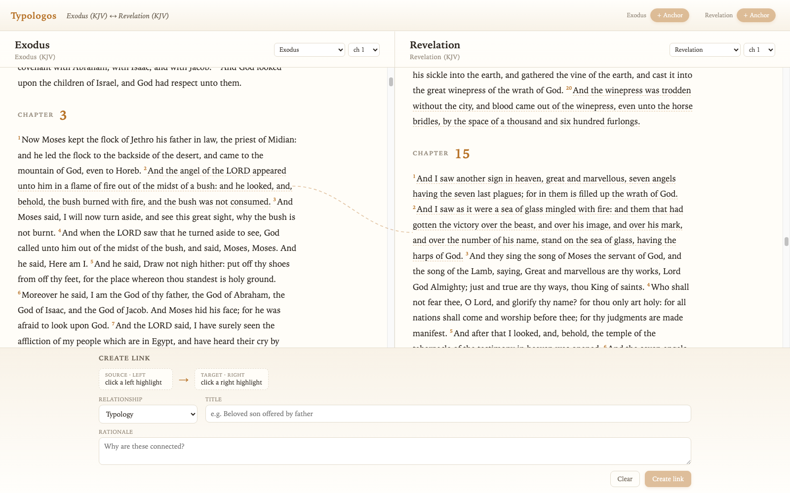
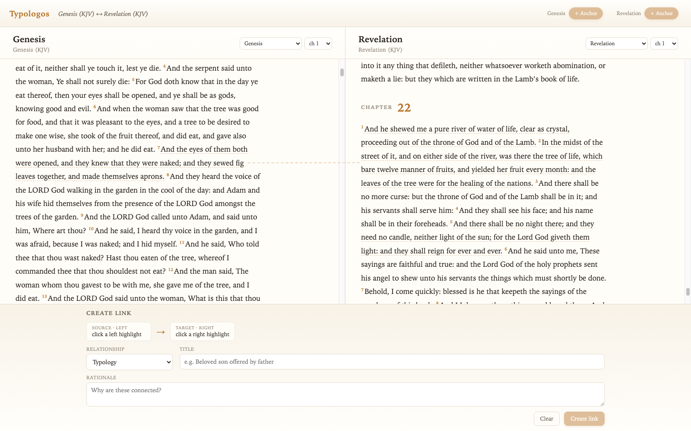
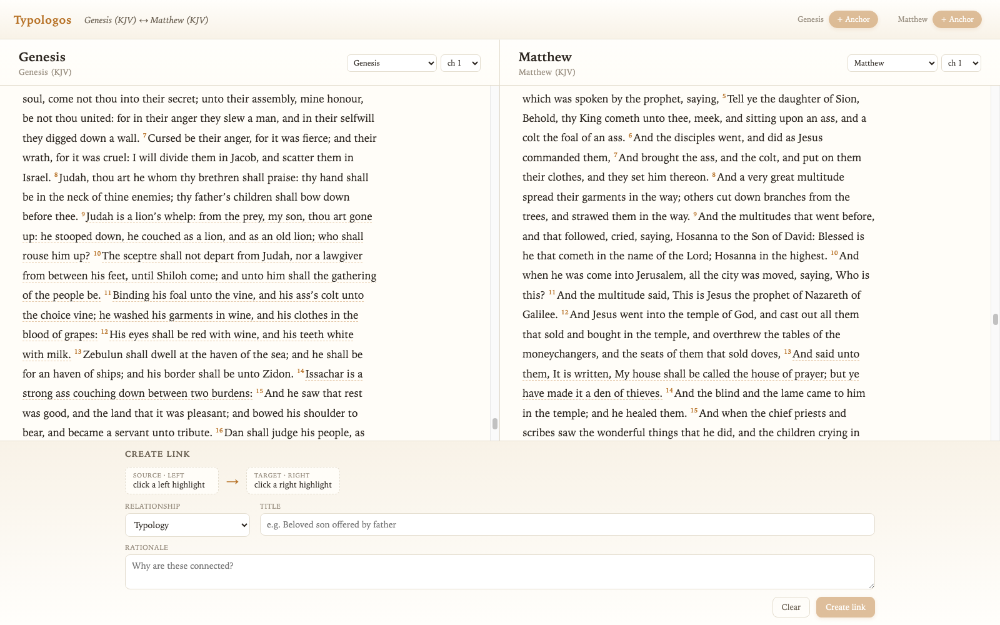

# Night log — 2026-07-10

Overnight autonomous session. Each section notes the git checkpoint so you can
`git checkout <hash>` to see that state. Screenshots in this folder were
captured headlessly via the new deep-link URLs.

## Where things stood at bedtime

Checkpoint `fe5518b` — Wilson's *Dictionary of Bible Types* imported (1,109
motifs / 4,077 verse-anchored instances with his a/b/c grades), dashed
underlines + hover tooltip + Types & Figures drawer, chapter-window panes.

## 1. Continuous book scrolling — `31947bb`

- A pane now holds a **whole book** (one fetch; Exodus ≈ 78,000px of scroll).
  Chapter headings break the verse flow; the navigator's chapter picker
  *scrolls* instead of reloading.
- Short hops scroll smoothly; jumps beyond ~2,500px are instant — Chrome
  paints blank frames if you smooth-scroll 35,000px.
- **Deep links**: `?left=kjv-Gen:3:7&right=kjv-Rev:22:2` restores an exact
  juxtaposition (book:chapter:verse; verse centers on load). This is also how
  these screenshots were reproduced headlessly.
- Old saved views migrate automatically; drawer cross-navigation now scrolls
  in place when the target book is already open.

## 2. Wilson typology arcs — `1ed0c0d`

The reference layer finally has strings. When a verse visible in the left pane
and a verse visible in the right pane share a Wilson motif, a **quiet dashed
arc** connects them (distinct from your solid hand-authored links). Hover
lists the shared motifs; click opens the drawer. Pairs are deduped per verse
pair and the stroke thickens slightly with more shared motifs.

Favorite discovery of the night: **Genesis 3:7 ↔ Revelation 22:2 via "Leaf"**
— fig leaves sewn to cover shame ↔ leaves of the tree of life healing the
nations. The system surfaced that on its own.

### Findings on comprehensibility

- Wilson pairs are **naturally sparse at reading zoom**: the densest
  chapter-vs-chapter pairing in the whole KJV is 2–3 arcs. No spaghetti at
  text scale — the 80-arc cap I built basically never triggers. The "see the
  structure" moment at scale will need the minimap/overview layer.
- Wilson connects verses through **shared symbols** (both verses instantiate
  "Lamb"), not curated type→antitype pairs. So arcs read as "same figure
  appears here and there" — genuinely useful, but a hand-authored link layer
  (or Atwill-style claimed parallels) carries more intent.

### Debugging war story (affects you!)

Arcs computed to zero for a solid hour because **Chrome starves
`requestAnimationFrame` and rendering in occluded windows** — your Chrome was
presumably behind another window while you slept. Position measurement never
ran; even programmatic scrolls don't emit scroll events without rendering
frames. Fix: measurement falls back to a timeout and a slow 800ms poll with a
change-fingerprint (no idle re-renders). The connector overlay was silently
subject to the same bug since day one.

## 3. Caesar's Messiah layer

See section below (written as the work happened).
